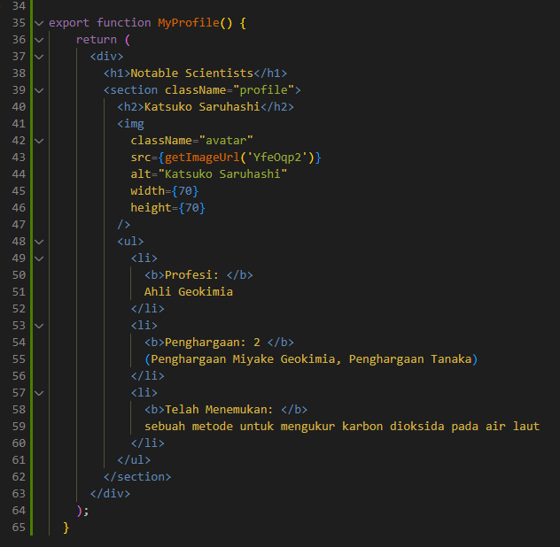

## Laporan Praktikum

|  | Pemrograman Berbasis Framework 2024 |
|--|--|
| NIM |  2141720167|
| Nama |  Evan Fadhilah Dzulfikar |
| Kelas | TI - 3I |

### Jawaban Soal 1

"Change the contents of the Home() code so that it appears as follows by utilizing the Profile() component that was created in step 1!"

    What I learn from this task is that we can make an components and use it again easily.
    Also, to reference image from external source (internet) I need a next.config.js configuration to process the image.

### Jawaban Soal 2

    What I learn from this task is that I can use components that can use other components many times.
    About the interface, it is slightly changed because the picture doesn't have 
 like before.

### Jawaban Soal 3

"Please fix the following JSX code. You can use a converter or fix it manually."

    The error is happened, because
    1. We need to wrap the code in JSX fragment example : <> code <>
    2. We need to change 
 into 

    3. We need to change   into  
    4. Also, the we need to include word "ilmuwan!" in to the syntax <b>!

### Jawaban Soal 4
"The code above still contains errors, please correct them."

    I fix the problem in line 12, I changed it into {person.name}

### Jawaban Soal 5
"Open the src/components/todolist.tsx file and extract the image URL into the person object."
"Capture the results and create a report in README.md. Is there a difference in the appearance of the web today?"

-Before-

-After-

    As seen in the picture above, there is no difference in the website.

### Jawaban Soal 6
"Correct the code in the src attribute section. You can adjust other codes from the answers to the previous questions. Capture the results and create a report in README.md. Explain what you have learned and how does it look now?"

-Before-

-After-

    What I learn is we can change the URL expression. We can implement set base URL and maybe user can just input the additional/detailed url.
    It looks the same as before (same as the previous question).

"To check if your fix works, try changing the value of imageSize to 'b'. Images should adjust to size after conversion."

### Jawaban Soal 7
"This MyGallery component contains two identical markups. Extract it into a MyProfile component to reduce duplication. You need to choose what props will be sent."

"Explain what you have learned and how does it look now?"

    I learned that we can separate markup so that we easy to differentiate between the two. We can make it into different components!

